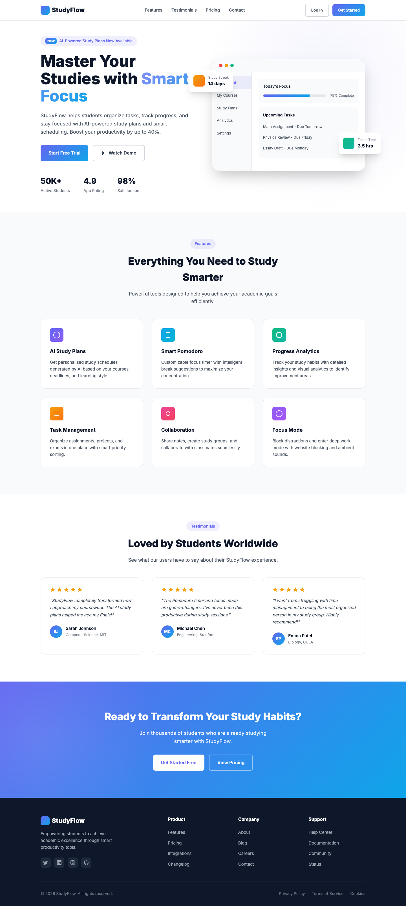
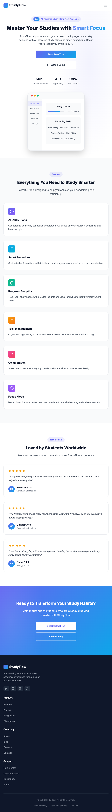
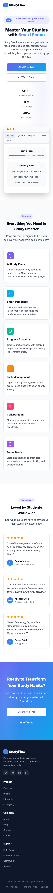

# StudyFlow - Smart Study Productivity Tool

## Project Overview
StudyFlow is a responsive landing page for a modern study productivity platform. It features a clean, professional design with a focus on usability and performance across all devices.

**Live Demo:** https://studyflow-alpha-two.vercel.app  
**GitHub:** https://github.com/Ree-gift/studyflow

---

## Tech Stack
| Technology | Purpose |
|-----------|---------|
| HTML5 | Semantic page structure |
| CSS3 | Styling, Flexbox, Grid, animations, media queries |
| JavaScript (Vanilla) | Mobile menu toggle, scroll effects, smooth navigation |
| Vercel | Deployment & hosting |

---

## Features Implemented
- **Header/Navigation** - Fixed navbar with logo, nav links, and CTA buttons
- **Hero Section** - Gradient text, stats, CTA buttons, app mockup with floating cards
- **Features Section** - 6 feature cards in responsive CSS Grid layout
- **Testimonials Section** - 3 testimonial cards with star ratings
- **CTA Section** - Call-to-action with gradient background
- **Footer** - Multi-column layout with links and social icons

### Responsive Breakpoints
| Device | Breakpoint |
|--------|-----------|
| Desktop | > 1024px |
| Tablet | 768px - 1024px |
| Mobile | < 768px |
| Small Mobile | < 480px |

### Interactivity
- Hover effects on all buttons and cards
- Mobile hamburger menu with smooth toggle
- Smooth scroll navigation
- Scroll-based header shadow effect
- Floating card animations

---

## Setup Instructions

### Local Development
```bash
# Clone the repository
git clone https://github.com/Ree-gift/studyflow.git
cd studyflow

# Open index.html in any browser
# Or use a local server:
npx serve .
```

### Deployment
Deployed on Vercel. Any push to `main` branch triggers automatic deployment.

---

## Screenshots
_Screenshots will be added soon._

<!-- 
### Desktop (1440px)


### Tablet (768px)


### Mobile (375px)

-->

---

## Key Decisions

### Design Choices
1. **Color Palette:** Indigo (`#6366f1`) as primary with sky blue (`#0ea5e9`) accent - conveys trust, focus, and productivity appropriate for a study tool
2. **Typography:** Inter font family - clean, modern, excellent readability for academic-focused audience
3. **CSS Variables:** Used for consistent theming and easy customization
4. **No Frameworks:** Pure HTML/CSS/JS to keep the project lightweight and dependency-free

### Technical Decisions
1. **CSS Grid + Flexbox:** Grid for main layouts (features, testimonials, footer), Flexbox for component-level alignment
2. **Mobile-First Approach:** Base styles for desktop with media queries for tablet and mobile adjustments
3. **CSS-Only Icons:** Used CSS shapes and SVG masks for social icons to avoid external dependencies
4. **App Mockup in CSS:** Created the dashboard mockup purely in CSS/HTML rather than images to keep the project lightweight

### Accessibility Considerations
- Semantic HTML5 elements (`header`, `nav`, `section`, `footer`)
- ARIA labels on interactive elements
- Proper color contrast ratios
- Smooth scroll behavior for navigation

---

## Project Structure
```
studyflow/
├── index.html          # Main HTML file
├── styles.css          # All styles with responsive breakpoints
├── script.js           # Mobile menu and scroll interactions
├── screenshots/        # Device screenshots
│   ├── desktop.png
│   ├── tablet.png
│   └── mobile.png
├── .gitignore          # Git ignore rules
└── README.md           # Project documentation
```
